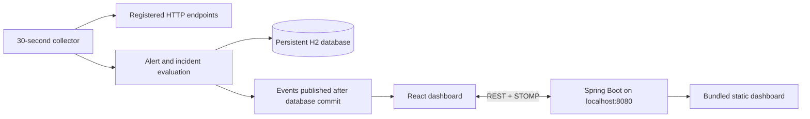

# PulseWatch

Local application monitoring with a React dashboard and Spring Boot API. Register HTTP endpoints, collect measured health checks, inspect latency, and manage alerts and incidents.

**No login, Docker, PostgreSQL installation, Redis installation, or Vercel account is needed for the local app.**

## Start on Windows

Install Java 17+, Maven 3.9+, and Node.js 22.12+ and make them available on PATH. From this project folder:

```powershell
.\Start-PulseWatch.ps1
```

Open **http://localhost:8080**. The script builds the dashboard into the Java application, starts one background server, and waits for a healthy API. It does not open extra terminal windows. Initial dependency downloads need internet access.

```powershell
.\Stop-PulseWatch.ps1
.\Start-PulseWatch.ps1 -SkipBuild  # reuse the last built application
```

Run without `-SkipBuild` after changing source code. Stop the server before rebuilding. If port 8080 belongs to another application, the launcher reports the conflict without stopping that application.

- Logs: `.runtime/server.log` and `.runtime/server-error.log`.
- Saved services, checks, metrics, alerts and incidents: `backend/data/pulsewatch.mv.db`.
- Stop the app before backing up `backend/data`. These files are ignored by Git.
- The no-login server binds to `127.0.0.1`. This is a local single-user workspace, not a public multi-user service.

## Use the dashboard

1. Select **Add service**. Enter a hostname or IPv4 address without `http://`, a port, an environment, and a health path beginning with `/`.
2. To monitor PulseWatch itself, use `localhost`, port `8080`, and `/actuator/health`.
3. Select a service to see individual measured latency, edit its configuration, pause it, check it immediately, or delete it and its history.
4. The collector runs every 30 seconds. REST refresh runs every 15 seconds, with STOMP events delivering state changes sooner.
5. Acknowledge alerts while investigating. Recovery resolves the corresponding alert and open incident. Manual resolution closes that incident too; a continuing failure can open a new alert.

Nothing is presented as healthy until a real HTTP check completes. API errors retain the last received data and display an offline warning. The connection badge distinguishes WebSocket live updates from polling.

## Architecture



Each collected service has its own transaction. Service row locks serialize checks, updates, and deletion for a target. A failed collection does not roll back other services. Event data is materialized before the transaction closes and sent after commit, so browser refreshes can read the committed result.

Health classification uses HTTP status and observed elapsed time: non-2xx or unreachable is DOWN, a successful response above 1,500 ms is DEGRADED, and other successful responses are UP. One retry is allowed by default. Latency includes retries and retry delay. Health responses are evaluated by HTTP status, not custom JSON status fields.

One active alert per service and issue avoids duplicates. DOWN is CRITICAL; high latency is WARNING. Consecutive DOWN checks spanning at least two minutes open an incident. Recovery resolves it. Paused targets are excluded from health counters.

The latency chart uses the last 100 individual checks. Uptime and p95/p99 use the last 100 checks; metric snapshots contain cumulative health-check counts and average latency. These measure probes, not real application traffic. Metrics are updated incrementally rather than rescanning all historical checks.

## API

Routes are unauthenticated and intended for loopback access. Service request fields: `name`, `host`, `port`, `environment`, `healthEndpoint`, `enabled`.

| Method | Path | Purpose |
|---|---|---|
| POST / GET | `/api/services` | Register / list services |
| GET / PUT / DELETE | `/api/services/{id}` | Read / update / delete service and history |
| POST | `/api/services/{id}/check` | Run a real check immediately |
| GET | `/api/services/{id}/health` | Last 100 checks |
| GET | `/api/services/{id}/metrics` | Last 100 snapshots and latency percentiles |
| GET | `/api/dashboard/summary` | Dashboard counters |
| GET | `/api/alerts` | Alerts |
| PUT | `/api/alerts/{id}/acknowledge` | Acknowledge active alert |
| PUT | `/api/alerts/{id}/resolve` | Resolve alert and its open incident |
| GET | `/api/incidents` or `/api/incidents/{id}` | Incident history / detail |
| GET | `/actuator/health` | API readiness |

STOMP endpoint: `/ws`; event topic: `/topic/events`. Events include a timestamp. Registration validates host, path, lengths and port; duplicate names return 409, invalid requests return 400, and missing services return 404.

## Development and verification

For frontend hot reload, run `backend/run-local.ps1` and `npm run dev --prefix frontend` in separate terminals. Open http://localhost:5174. Vite proxies to `127.0.0.1:8080`; port 5174 stays dedicated to this project. The packaged app on port 8080 does not need Vite or a proxy.

```powershell
npm ci --prefix frontend
npm run build --prefix frontend
mvn -f backend/pom.xml test
npm audit --prefix frontend
```

On affected Windows JDKs, set `TEMP` and `TMP` to `C:\tmp` before running Java tests. Both launch scripts set a short temporary path to avoid the JDK local socket path limitation.

The regression suite covers no-login API access, real HTTP checks against a disposable local HTTP server, metric serialization and accumulation, failure deduplication, acknowledgement, recovery and incident closure, deletion of dependent data, paused checks, duplicate names, malformed identifiers, and request validation. GitHub Actions runs the frontend build and Maven verification on pushes and pull requests.

## Configuration and scope

Defaults are in `backend/src/main/resources/application.yml`; local overrides are in `application-local.yml`. Collector interval, timeout, retry count/delay, latency threshold and incident duration can be overridden with the environment variables shown in `.env.example`. PowerShell does not load that file automatically.

The retained non-local profile supports separately configured PostgreSQL and Redis. It is not needed for the local app and has not been verified against live external databases in this pass. No deployment was created.

Current scope: HTTP targets (no HTTPS selector), one sequential collector, and persistent local history without automated retention. Large installations need retention, paginated alert/incident lists, a concurrent collector, schema migrations and an authenticated deployment configuration. No throughput or production availability claims are made.

Optional load check against a disposable local endpoint:

```powershell
python loadtest.py http://localhost:8080/actuator/health --requests 500 --concurrency 20
```
