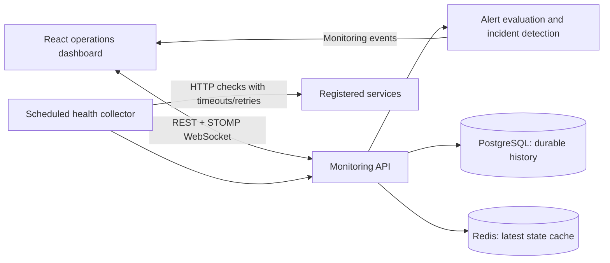
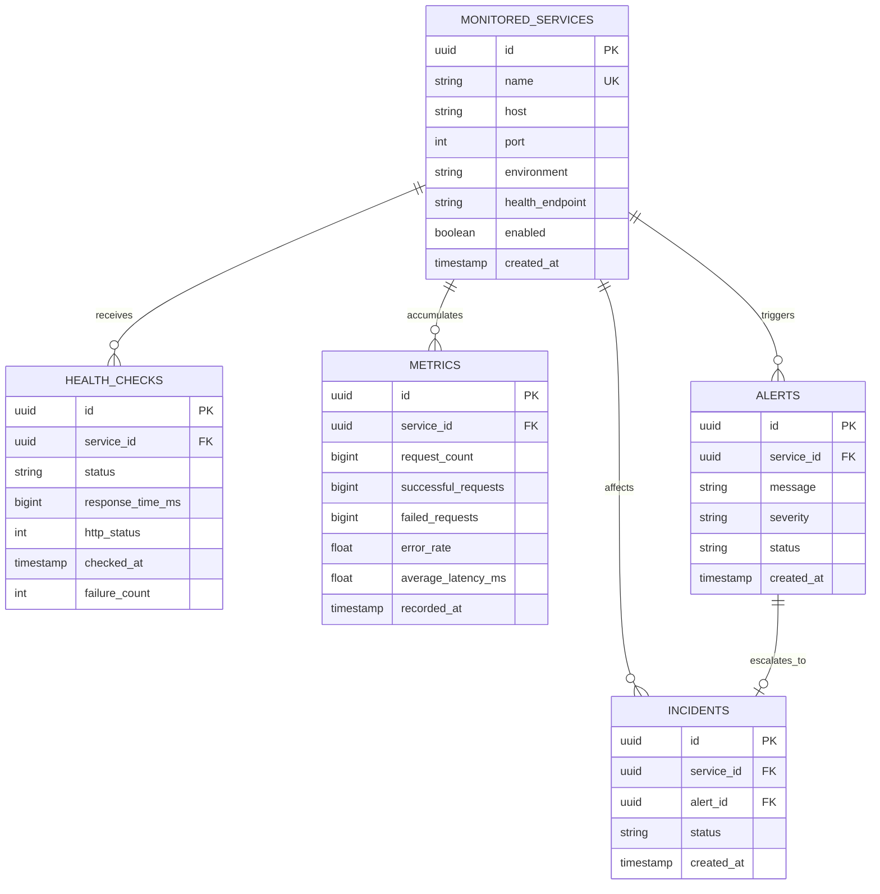

# PulseWatch

PulseWatch is a small service-oriented monitoring platform for checking internal HTTP services, retaining measured health history, detecting repeated failures, and streaming operational events to a live dashboard. It demonstrates operational monitoring workflows rather than generic CRUD.

## Architecture



The collector and alert engine are modules in one deployable Spring Boot service. This keeps the first deployment simple while preserving clear responsibilities and makes later extraction practical.

## Responsibilities

- **Monitoring API:** validated service registration, health/metric history, alert lifecycle, incidents, and dashboard summary.
- **Collector:** scheduled HTTP checks with bounded timeouts, configurable retries, measured latency/status, and per-service error isolation.
- **Alert engine:** deduplicates ongoing DOWN/degraded conditions, resolves DOWN alerts on recovery, and escalates repeated critical failures.
- **Dashboard:** React/Bootstrap operator view with summary cards, service selection, historical latency chart, live event stream, alert actions, and incidents.

## Data model



Hibernate creates the schema for local development. Production deployments should use versioned migrations and schema validation instead of automatic updates. Foreign keys and indexes support service/time history queries, enabled-service collection, and alert/incident filtering.

## Redis and PostgreSQL

PostgreSQL is the durable source for service configuration, individual health checks, metric snapshots, alerts, and incidents. Redis holds a five-minute latest-health snapshot keyed by service ID so concurrent dashboard consumers can access current state cheaply; losing Redis does not lose history. Historical REST endpoints currently read PostgreSQL, so Redis is an optimization seam and current-state cache rather than an alternate source of truth.

## Docker Compose

1. Copy `.env.example` to `.env` and set non-default database and admin passwords.
2. Run `docker compose up --build` from the repository root.
3. Open the dashboard at [http://localhost:3000](http://localhost:3000); API is on port 8080.
4. Sign in using the configured admin credentials. HTTP Basic protects API operations; `/actuator/health` and the WebSocket handshake are public.

Register a monitored service (reachable from the API container):

```sh
curl -u "$ADMIN_USERNAME:$ADMIN_PASSWORD" -H 'Content-Type: application/json' \
  -d '{"name":"payments","host":"host.docker.internal","port":8081,"environment":"development","healthEndpoint":"/actuator/health","enabled":true}' \
  http://localhost:8080/api/services
```

On Linux, `host.docker.internal` may need an explicit host-gateway mapping. For container-to-container checks, use the Compose service DNS name.

## REST API

All `/api/**` routes use HTTP Basic authentication. Service create/update JSON fields are `name`, `host`, `port`, `environment`, `healthEndpoint`, and `enabled`.

| Method | Path | Description |
|---|---|---|
| POST/GET | `/api/services` | Register/list services |
| GET/PUT/DELETE | `/api/services/{id}` | Read/update/remove service |
| GET | `/api/services/{id}/health` | Recent measured checks |
| GET | `/api/services/{id}/metrics` | Aggregates, percentiles, uptime, snapshots |
| GET | `/api/alerts` | List alerts |
| PUT | `/api/alerts/{id}/acknowledge` | Acknowledge an alert |
| PUT | `/api/alerts/{id}/resolve` | Resolve an alert |
| GET | `/api/incidents`, `/api/incidents/{id}` | List/read incidents |
| GET | `/api/dashboard/summary` | Dashboard counters and measured latest latency |

## Real-time events

The UI connects to `/ws` with STOMP and subscribes to `/topic/events`. Collector transitions, alert creation/resolution, alert updates, and incident creation publish events. The UI also refreshes summary data periodically to reconcile missed WebSocket updates. No synthetic service readings are seeded.

## Alert behavior

Checks classify non-2xx/unreachable targets as DOWN, successful responses over the configured latency threshold as DEGRADED, and other successful responses as UP. One unresolved alert per service and issue prevents duplicates. DOWN alerts are CRITICAL; latency alerts are WARNING. A DOWN alert resolves on recovery. Repeated DOWN checks can escalate to an incident. Timeout, interval, retry count/delay, latency threshold, and incident duration are configurable.

## Build and test

```sh
cd backend
mvn test
mvn package
cd ../frontend
npm ci
npm run build
```

The current suite has four focused unit tests covering request validation and alert lifecycle transitions. Collector failure/recovery, controller behavior, and PostgreSQL/Redis integration scenarios are not covered yet.

## Load testing

Run against a reachable HTTP endpoint, ideally a disposable test service:

```sh
python loadtest.py http://localhost:8080/actuator/health --requests 500 --concurrency 20
```

The script prints measured throughput, latency percentiles, and error rate for that run. This README makes no performance claims.

## Design decisions and tradeoffs

- A modular monolith avoids network hops between collection and alert evaluation while retaining service/repository boundaries.
- PostgreSQL preserves history; Redis is disposable and caches the latest observed state.
- HTTP Basic is intentionally small for a single-operator demonstration. Put the API behind TLS and replace in-memory users with an identity provider for multi-user deployments.
- In-process scheduling suits a small installation; distributed deployments need per-target locks/leases to avoid duplicate checks.
- Metrics reflect measured health-check observations, not application traffic. CPU and memory are omitted because generic external services do not expose them.
- Before production: add schema migrations, pagination/retention, managed credentials, restricted WebSocket origins, richer integration tests, and collector concurrency/backpressure controls.
